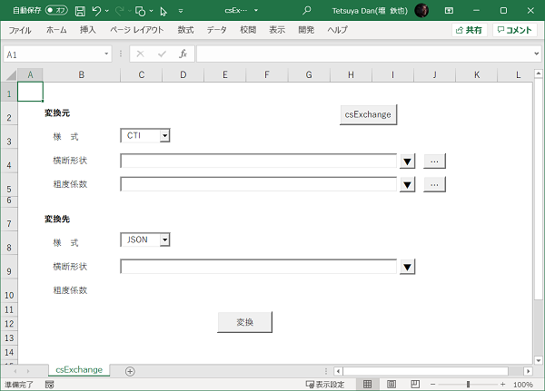

## csExchange

様式の異なる河道横断測量成果（水位計算の入力データ）を相互変換する。



### Requirement

* python3.X（**openpyxl がインストール済みである事**）
* csExcghange.py と template_Q2DFNU.xlsm は同一のディレクトリに配置する。

### 対応している様式

#### NK

* Q2DFNU.xlsm のフォーマット

#### CTI

* 横断形状のデータは **txt**、**csv**、**xlsx** の何れか。
後二者は **txt** の固定長データ（下図）をそれぞれの様式に変換したもの。

    

* 粗度係数のデータは **csv**。
フィールド数：4（距離標、左岸高水敷、右岸高水敷、低水路）、ヘッダ：あり。

#### MLIT

* [河川定期縦横断データ作成ガイドライン](doc/guideline.md)に準拠した横断測量成果の数値データ、
あるいは左記による各測線のデータを下流側からひとつの **csv** ファイルにまとめたもの。
* 粗度係数のデータは含まれていない。

#### [JSON](doc/csJSON.md)

* 上記の 3 様式を統一した JSON
* [nunif.py](../../readme.md) の横断データのフォーマット
* [csEdit.xlsm](../csEdit/readme.md) の入力フォーマット

### 使用方法（csExchange.xlsm）

1. 右上の csExcghange ボタンをクリックして csExcghange.py の絶対パスを指定する。
1. 変換元の様式を選択する。
1. 横断形状データのファイル名を入力して▼ボタンをクリックする。
あるいは右端のボタンをクリックして選択する。
入力がエクセルのワークブックである場合は表示されるフォームでワークシートを選択する。
1. （変換元が CTI で変換が必要な場合）
マニングの粗度係数のデータファイル名を上条と同様に指定する。
1. 変換先の様式を選択する。
1. 横断形状データのファイル名を入力して▼ボタンをクリックする。
出力をエクセルのワークブックとする場合はファイル名の末尾に
「**\!ワークシート名**」を追加する。
1. （変換先が CTI で変換が必要な場合）
マニングの粗度係数を出力するファイル名を上条と同様に指定する。
1. 「変換」ボタンをクリックする。

### 使用方法（コマンドプロンプト）

次のコマンドを入力する（csExchange.xlsm はこのコマンドを生成して python を起動している）。

```
python csExchange.py -from type path[!sheet] [rough=path[!sheet] -to type path[!sheet] [rough=path[!sheet]]
```

type は上記の様式の何れか。path はファイル名ないしディレクトリ名。
sheet はワークシート名。rough は粗度係数のデータを指す。